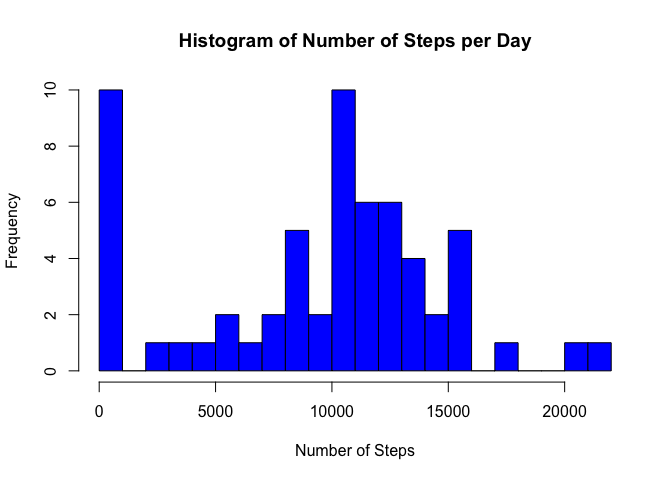
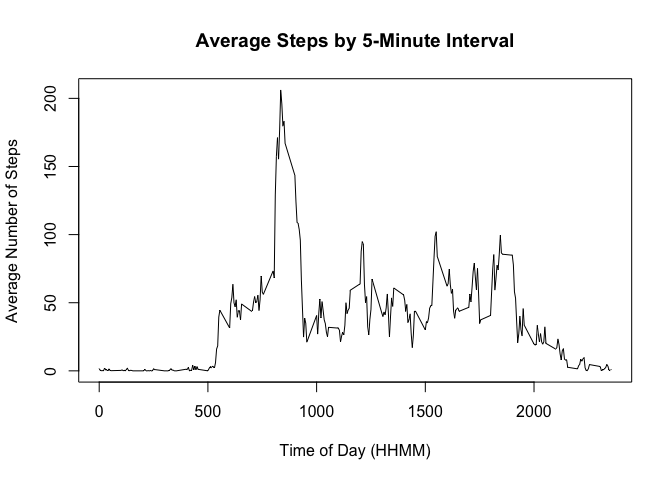
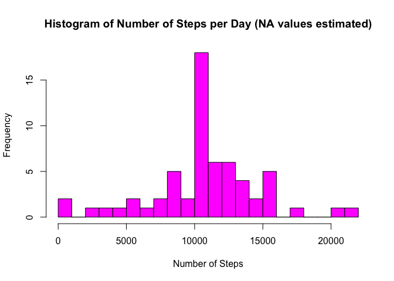
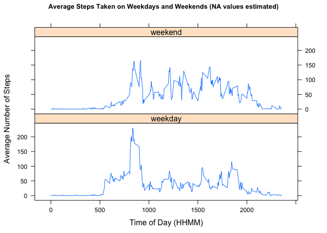

# Reproducible Research - Assignment One
gopault  
2017-08-11  


This assignment uses data from a personal activity monitoring device over a two-month period (October and November 2012. Data was collected on the number of steps taken at 5-minute intervals throughout each day.


## Loading and preprocessing the data

The raw *activity* dataset is part of this repository. The R code below assumes that the dataset has been unzipped and saved to the working directory.

The data is read into the *activity* dataframe. The *date* field is converted from factors to dates and the *steps* field is converted from integer to numeric.


```r
activity <- read.csv("./activity.csv")

activity$date <- as.Date(activity$date)
activity$steps <- as.numeric(activity$steps)
```


## What is mean total number of steps taken per day?


First, tapply is used to calculate the sum of steps on each date. NA values are removed.


```r
count_by_date <- with(activity, tapply(steps, date, sum, na.rm = TRUE))
```


Second, a histogram is created of the total steps taken in a day. The Y-axis shows how frequently a given number of steps occurs in the data.

Note the number of days with 0 steps are dates when data was not collected (i.e., NA values).


```r
hist(count_by_date, breaks = 20, xlab = "Number of Steps", main = "Histogram of Number of Steps per Day", col = "blue")
```

<!-- -->


Third, the mean and median total steps per day is calculated. For clarity, both are rounded to the nearest whole number.


```r
mean_steps <- round(mean(count_by_date),0)
median_steps <- round(median(count_by_date),0)
```

The mean steps per day is 9354. The median steps per day is 10395.


## What is the average daily activity pattern?

The average number of steps for each 5-minute time interval is calculated using the original *activity* data frame.


```r
steps_timeofday <- aggregate(steps ~ interval, data = activity, mean, na.rm = TRUE)
```

This data is then plotted.


```r
plot(steps_timeofday, type = "l", main = "Average Steps by 5-Minute Interval", ylab = "Average Number of Steps", xlab = "Time of Day (HHMM)")
```

<!-- -->

The time period when the most steps occur is computed.


```r
maxsteps <- steps_timeofday$interval[which.max(steps_timeofday$steps)]
```

On average, the most steps were taken at 835 (i.e., 8:35 AM).

## Imputing missing values

First, calculate the number of missing values.


```r
missing <- sum(is.na(activity$steps))
```

There are 2304 missing values in the *activity* dataframe.

The strategy to fill in these missing values is to replace each missing value with the average number of steps for that time period as calculated previously.

First, a new dataframe is created using the *activity* dataframe. An *if* is used to replace NA values with the corresponding average for that time period from the *steps_timeofday* dataframe.


```r
activity_impute <- activity

for (x in 1:nrow(activity_impute)){
      if (is.na(activity_impute$steps[x])){
        avg_steps <- steps_timeofday$steps[steps_timeofday$interval == activity_impute$interval[x]];
        activity_impute$steps[x] <- avg_steps
      }
}
```

In order to analyze the data with missing values imputed, the same tapply technique from the first part of the analysis is used again.


```r
actimp_by_date <- with(activity_impute, tapply(steps, date, sum))
```

A histogram of the data with imputed values is plotted.


```r
hist(actimp_by_date, breaks = 20, xlab = "Number of Steps", main = "Histogram of Number of Steps per Day (NA values estimated)", col = "magenta")
```

<!-- -->

The new mean and median total steps per day is calculated. For clarity, both are rounded to the nearest whole number.


```r
mean_actimp <- round(mean(actimp_by_date),0)
median_actimp <- round(median(actimp_by_date),0)
```

The mean steps per day with missing values replaced by average values for the same time period is 10766. The median steps per day is 10766.

The mean and median of the data with missing values replaced are both higher than the original calculations, where missing values were simply ignored.

The general shape of the two histograms is similar, but the histogram with imputed data has a higher frequency of occurrences near the mean.


## Are there differences in activity patterns between weekdays and weekends?

The *weekdays()* function is used to obtain the day of the week for each date in the *activity_impute* dataframe.


```r
activity_impute$day_of_week <- weekdays(activity_impute$date)
```

A factor variable is added to separate weekdays (Monday, Tuesday, Wednesday, Thursday, Friday) from weekends (Saturday, Sunday).


```r
activity_impute$weekday <- as.factor(ifelse(activity_impute$day_of_week == "Saturday" | activity_impute$day_of_week == "Sunday", "weekend", "weekday"))
```

Average steps by time interval are calculated and placed in a new data frame. This time, the *aggregate* function is used to group by both *interval* and *weekday*.


```r
stepsimp_timeofday <- aggregate(steps ~ interval + weekday, data = activity_impute, mean)
```


The *lattice* package is used to plot weekend vs weekday average steps by time interval.


```r
library(lattice)
xyplot(steps~interval | weekday, stepsimp_timeofday, layout = c(1,2), type = "l", ylab = "Average Number of Steps", xlab = "Time of Day (HHMM)", main = list("Average Steps Taken on Weekdays and Weekends (NA values estimated)",cex = 0.85))
```

<!-- -->

